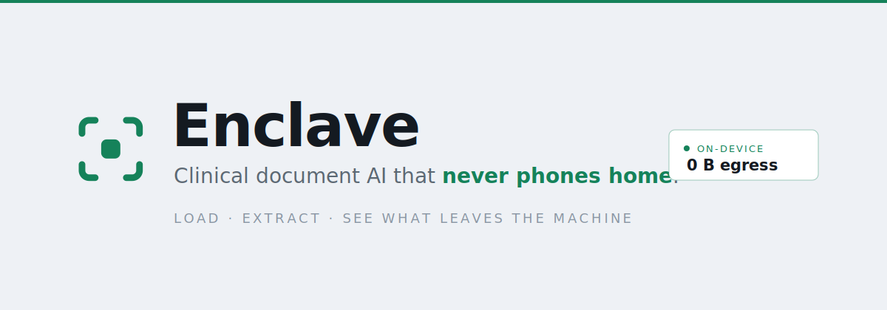

<picture>
  <source media="(prefers-color-scheme: dark)"  srcset="assets/banner-dark.svg">
  <source media="(prefers-color-scheme: light)" srcset="assets/banner-light.svg">
  
</picture>

[](https://github.com/Builder106/Enclave/actions/workflows/ci.yml)
[](https://nodejs.org/)
[](https://nextjs.org/)
[](https://ai-sdk.dev/)
[](https://enclave-iota.vercel.app)
[](#the-providers)
[](#license)

> **Enclave is an interactive workbench for clinical document extraction that never phones home.** Load a synthetic superbill, pick an extractor — a deterministic rules parser, a local on-device model, or a hosted cloud model — and run it. The source document sits on the left; a structured record fills in on the right, field-by-field, checked against ground truth. Beside it, a live gauge shows the thing that matters: whether the document's bytes stayed **on-device (0 B)** or **crossed to the cloud**. Privacy isn't asserted here — it's measured, per run, and you watch it happen.

**▶ Live: [enclave-iota.vercel.app](https://enclave-iota.vercel.app)** — pick a specimen, pick an extractor, hit Run.

## The workbench

<!-- DEMO_RECORDINGS -->
_Recordings land here once the demo suite is wired (see Roadmap)._ For now, the live link above is the fastest way in: choose **Groq** and watch ~2 KB travel device→cloud as the fields populate; switch to **Local** and the same extraction runs sealed at **0 B**.

## The headline findings

Every number below is a real measured run over 50 held-out synthetic superbills (`seed 1`), played back by the workbench — not a live demo of one lucky document.

**Rules baseline · deterministic parser, no model**

> **96.0% parse · 95.0% field accuracy · 84.0% exact match · code F1 98.3 · anomaly F1 90.0 — at sub-ms latency, $0, and 0 bytes egress.** The no-ML floor is deliberately high: a regex-and-heuristics parser over OCR-noisy text sets the bar a model has to clear before its latency and cost are worth paying.

**Local · qwen2.5:3b-instruct via Ollama**

> **100% parse · 96.3% field accuracy · 36.0% exact match · code F1 81.0 · anomaly F1 61.5 — 23.6 s p50 on an 8 GB M1, $0, 0 bytes egress.** The 3B *never fails to structure a document* and edges the floor on field accuracy, but trails on exact match, codes, and anomalies. The anomaly gap is a cascade, not a reasoning failure: misread charges poison the deterministic sum check and raise false flags. Verdict on this corpus: the local model's win is robustness on noise, not accuracy.

**Groq · openai/gpt-oss-120b**

> **100% parse · 98.3% field accuracy · 78.0% exact match · code F1 99.6 · anomaly F1 95.2 — $0.0008/doc metered ($0 on the free tier), 97,303 bytes egress.** Forty times the local model's parameters clears the floor on three of four headline metrics — and the egress column finally shows a number: **97 KB of (synthetic) PHI left the machine to buy that accuracy.** That's the thesis in one row: scale buys accuracy, and the price is denominated in bytes as much as dollars.

**Bedrock · Claude Haiku 4.5 — pending, honestly.** Blocked by AWS's new-account token-quota ramp (not self-service adjustable). A launchd job (`scripts/trial03-cron.sh`) retries daily with `--resume`, measuring only still-unmeasured docs each reset and removing its own schedule once coverage hits 50/50. Quota throttles are excluded from metrics as infrastructure noise.

**A caveat the numbers need:** the generator draws service-line descriptions from the *same* code dataset the matcher searches, so code-matching is easier here than against real free-text. Read the code-F1 numbers as harness ceiling-calibration, not a real-world coding claim. Full rationale in [docs/BRIEF.md](docs/BRIEF.md).

## How it works

```mermaid
sequenceDiagram
    autonumber
    actor User
    participant WB as Workbench (browser)
    participant Data as data/demo · measured results
    User->>WB: pick a specimen + an extractor (rules / local / groq)
    User->>WB: Run extraction
    WB->>Data: load the measured result for (document, provider)
    WB-->>User: reveal structured fields, each ✓/✗ vs ground truth
    WB-->>User: transmission gauge — 0 B on-device (green) or bytes→cloud (amber)
    Note over WB,Data: results are REAL measured runs, produced offline by the<br/>rules/local/groq pipeline; the workbench plays them back
```

Behind the browser, the measurement pipeline does the real work: `runDocument` sends the noisy text to one provider for the *perception* step (text → structured fields), then **deterministic TypeScript** does code matching and anomaly detection — the model proposes, the code disposes. (A lesson carried from [Helm](https://github.com/Builder106/Helm), where an LLM that read invoices at 91.9% dropped to 54% on multi-step policy math.) Every run is persisted with its egress-byte count; `scripts/export-demo.ts` joins those results with the source documents into what the workbench plays back.

## The providers

| Provider | What it is | Marginal cost | Where document bytes go |
|---|---|---|---|
| `rules` | Deterministic regex/heuristic parser — the no-ML floor | $0 | Nowhere. In-process. |
| `local` | Open-weights model via Ollama (`qwen2.5:3b-instruct`) | $0 | `localhost`. Never off-machine. |
| `groq` | Open-weights at datacenter scale (`openai/gpt-oss-120b`) | $0 on free tier (list price metered) | Groq. Counted byte-for-byte as `egressBytes`. |
| `bedrock` | Claude on AWS Bedrock — the hosted frontier ceiling | per-token (metered) | AWS. Counted byte-for-byte as `egressBytes`. |

Same pipeline, same eval split, same metrics — the provider is a one-line swap through the AI SDK. The question the workbench makes you feel: *is a 3B model running where the PHI lives good enough to skip the cloud?*

## Built end-to-end in Claude Code

Every line — domain contract, generator, the three-provider pipeline, eval harness, the interactive workbench, tests, this README — was written via Claude Code. Contract-first: [`src/lib/contract.ts`](src/lib/contract.ts) came before any module; the engine (generator / providers / agent loop / eval / db) is covered by unit tests and survived a full UI rewrite untouched. The commit history is the receipt; decisions and incidents are logged in [JOURNAL.md](JOURNAL.md).

## Quickstart

```bash
pnpm install
cp .env.example .env

pnpm generate --seed 1                  # 60 synthetic superbills (50 eval / 10 dev)
pnpm measure --provider rules --seed 1  # the no-ML baseline — runs anywhere, $0
tsx scripts/export-demo.ts              # join docs + results → data/demo/seed-1.json
pnpm dev                                # the workbench at localhost:3000
pnpm test                               # vitest suite (engine)
```

For the local path: install [Ollama](https://ollama.com), `ollama pull qwen2.5:3b-instruct`, then `pnpm measure --provider local`. For Groq, set `GROQ_API_KEY` in `.env` (free tier covers the eval volume). Each hosted credential is only touched by its own provider.

## Project structure

```
src/lib/contract.ts    ← the authority: domain types, Zod schemas, metrics, defaults
src/lib/codes/         ICD-10-CM + CPT datasets with synonyms and typical fees
src/generators/        seeded superbill generator + OCR-noise renderer
src/agent/             rules parser · LLM extraction · code matching · anomaly checks
src/eval/              metrics (field accuracy, PRF1, percentiles)
scripts/               generate.ts · measure.ts · export-demo.ts (CLI, tsx)
src/db/                Drizzle schema, libSQL client, audit log
src/app/ + src/components/workbench.tsx   the interactive workbench (Next.js)
data/demo/             per-document measured results the workbench plays back
```

## Provenance & lineage

Enclave is the AI-layer sequel to [MedCore](https://github.com/Builder106/MedCore) (winner, 2026 Yale Africa Innovation Symposium), which argued that clinics in low-connectivity settings need offline-first records. Enclave extends it to the intelligence layer: if the records can't depend on the cloud, neither should the model reading them. The FHIR R4 shapes and audit-log pattern are harvested from MedCore. Across the portfolio: [TradeTell](https://github.com/Builder106/IMC_Prosperity) covers retrieval, [Helm](https://github.com/Builder106/Helm) covers orchestration and measurement of hosted models, Enclave covers local inference where hosted models legally can't go.

## Roadmap

- **Bedrock column** — let the cron-accumulated Trial 03 finish; publish all four providers.
- **Compare mode** — run one specimen through all three extractors side-by-side so the accuracy-vs-egress tradeoff reads in a single shot.
- **Demo recordings** — wire the Gherkin/Playwright demo suite and embed the walkthrough GIFs above.
- **LoRA adaptation** — fine-tune the 3B on generator output to close the parity gap with the hosted model.

## License

MIT — see [LICENSE](LICENSE).
