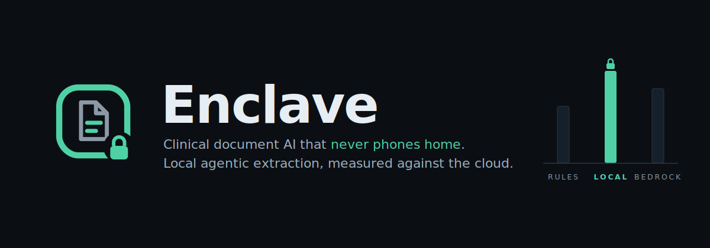
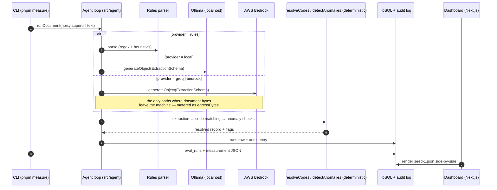

<picture>
  <source media="(prefers-color-scheme: dark)"  srcset="assets/banner-dark.svg">
  <source media="(prefers-color-scheme: light)" srcset="assets/banner-light.svg">
  
</picture>

[](https://github.com/Builder106/Enclave/actions/workflows/ci.yml)
[](https://nodejs.org/)
[](https://nextjs.org/)
[](https://ai-sdk.dev/)
[-success.svg)](#the-four-provider-design)
[](#license)

> **Enclave is a local-first agentic pipeline for clinical/billing documents.** OCR-noisy superbills go in; structured records come out — extraction → ICD-10/CPT code matching → anomaly flagging — running entirely on-device via Ollama, with metered hosted baselines (Groq open-weights, AWS Bedrock frontier) and a deterministic rules parser as the no-ML floor. PHI never leaves the machine on the local path, and the eval harness *proves* it: egress bytes are a first-class metric, measured per run, rendered on the dashboard next to accuracy and cost.

## The headline findings

**Trial 01 — Rules baseline · 50 held-out synthetic superbills · deterministic parser, no model**

> **96.0% parse rate, 95.0% field accuracy, 84.0% exact match, code-match F1 98.3% (P 100 / R 96.7), anomaly-detection F1 90.0% (P 100 / R 81.8) — at 0.15 ms p50 / 0.44 ms p95, $0, and 0 bytes of PHI egress.** The no-ML floor is deliberately high: a regex-and-heuristics parser over OCR-noisy text sets the bar both models have to clear before their latency and cost are worth paying. Reproduce: `pnpm generate --seed 1 && pnpm measure --provider rules --seed 1`.

**Trial 02 — Local model · qwen2.5:3b-instruct via Ollama · same 50 docs**

> **100% parse rate, 96.3% field accuracy, 36.0% exact match, code-match F1 81.0% (P 81.2 / R 80.8), anomaly-detection F1 61.5% — at 23.6 s p50 / 33.3 s p95 per document on an 8 GB M1, $0, and 0 bytes of PHI egress.** The 3B model *never fails to structure a document* (100% vs the parser's 96%) and edges the floor on field accuracy (96.3 vs 95.0) — but trails badly on exact match, code assignment, and anomaly detection, and pays five orders of magnitude in latency. The anomaly gap is a cascade, not a reasoning failure: misread charges flow into the deterministic sum check and raise false mismatch flags (precision 53.3%) — the same perception-poisons-arithmetic pattern Helm measured on payout math. Verdict on this corpus: the regex floor holds; the local model's win is robustness on noise, not accuracy. (Model chosen for an 8 GB machine — rerun on ≥16 GB with `--model qwen2.5:7b-instruct` to test the size hypothesis.) Reproduce: `ollama pull qwen2.5:3b-instruct && pnpm measure --provider local --seed 1`.

**Trials 03 & 04 — pending, honestly.** No numbers will appear here until the runs execute.

- **Trial 03 (Bedrock / Claude Haiku 4.5):** blocked by AWS's new-account ramp — fresh accounts get Claude's daily-token quota pinned near zero, and it is not self-service adjustable. A launchd job (`scripts/trial03-cron.sh`) retries daily with `--resume`, measuring only still-unmeasured docs each reset until coverage reaches 50/50; quota throttles are excluded from metrics as infrastructure noise, never counted as model failures.
- **Trial 04 (Groq / Llama 3.3 70B):** the hosted *open-weights* ceiling — same model family as the local 3B, so the column answers "is it the size or the family?" Runs on Groq's free tier: `GROQ_API_KEY=... pnpm measure --provider groq --seed 1`. Its egress column is deliberately nonzero — proof the meter isn't decorative.

**A caveat the numbers need:** the synthetic generator draws service-line descriptions from the *same* code dataset the matcher searches (verbatim or via synonyms), so code-matching is materially easier here than against free-text from real clinicians. The rules baseline's 98.3% code F1 should be read as a ceiling-calibration of the harness, not a claim about real-world coding. See [docs/BRIEF.md](docs/BRIEF.md) for the full design rationale.

## How it works



The model is used for the *perception* step only — messy text to structured fields. Code matching and anomaly detection are deterministic TypeScript: the model proposes, the code disposes. That split is the architecture (a lesson carried over from [Helm](https://github.com/Builder106/Helm)'s payout-reconciler finding, where an LLM that read invoices at 91.9% dropped to 54% on multi-step policy math).

## The four-provider design

| Provider | What it is | Marginal cost | Where document bytes go |
|---|---|---|---|
| `rules` | Deterministic regex/heuristic parser — the no-ML floor | $0 | Nowhere. In-process. |
| `local` | Open-weights model via Ollama (`qwen2.5:3b-instruct` default) | $0 | `localhost:11434`. Never off-machine. |
| `groq` | Same open-weights family at datacenter scale (`llama-3.3-70b-versatile`) | $0 on free tier (list price metered) | Groq. Counted byte-for-byte as `egressBytes`. |
| `bedrock` | Claude on AWS Bedrock — the hosted frontier ceiling | per-token (metered) | AWS. Counted byte-for-byte as `egressBytes`. |

Same agent loop, same eval split, same metrics — the provider is a one-line swap through the AI SDK. The comparison the dashboard renders is the product: *is a 3B model running where the PHI lives good enough to skip the cloud?*

## Built end-to-end in Claude Code

Every line of this repo — scaffold, domain contract, generator, agent loop, eval harness, dashboard, tests, this README — was written via Claude Code, from commit zero. The workflow was contract-first: [`src/lib/contract.ts`](src/lib/contract.ts) was authored before any module, then parallel agents built generator / DB / providers / agent-loop / eval / dashboard against it, then an integration pass drove typecheck, 24 unit tests, an end-to-end measured run, and a production build to green. The commit history is the receipt; decisions and incidents are logged as they happened in [JOURNAL.md](JOURNAL.md).

## Quickstart

```bash
pnpm install
cp .env.example .env

pnpm generate --seed 1               # 60 synthetic superbills (50 eval / 10 dev)
pnpm measure --provider rules --seed 1   # the no-ML baseline, runs anywhere
pnpm dev                             # dashboard at localhost:3000
pnpm test                            # vitest suite
```

For the local model path install [Ollama](https://ollama.com), then `ollama pull qwen2.5:3b-instruct` and `pnpm measure --provider local`. For Groq, set `GROQ_API_KEY` in `.env` (free tier covers the eval volume). For Bedrock, set the AWS env vars in `.env` (see `.env.example`) — each hosted credential is only touched by its own provider.

## Project structure

```
src/lib/contract.ts    ← the authority: domain types, Zod schemas, metrics, defaults
src/lib/codes/         ICD-10-CM + CPT datasets with synonyms and typical fees
src/generators/        seeded superbill generator + OCR-noise renderer
src/agent/             rules parser · LLM extraction · code matching · anomaly checks · runDocument
src/eval/              metrics (field accuracy, PRF1, percentiles)
scripts/               generate.ts · measure.ts (CLI, tsx)
src/db/                Drizzle schema, libSQL client, audit log
src/app/               dashboard (Next.js App Router) + /api/measurements
data/measurements/     measured JSON — the dashboard's single source of truth
```

## Provenance & lineage

Enclave is the AI-layer sequel to [MedCore](https://github.com/Builder106/MedCore) (winner, 2026 Yale Africa Innovation Symposium), which made the case that clinics in low-connectivity settings need offline-first records. Enclave extends the thesis to the intelligence layer: if the records can't depend on the cloud, neither should the model reading them. The FHIR R4 resource shapes and the audit-log pattern are harvested directly from MedCore's server. Within the wider portfolio: [TradeTell](https://github.com/Builder106/IMC_Prosperity) covers retrieval, [Helm](https://github.com/Builder106/Helm) covers orchestration and measurement of hosted models, Enclave covers local inference where hosted models legally can't go.

## Roadmap

- **Trials 03/04** — complete the Bedrock (cron-accumulated) and Groq columns; publish all four.
- **LoRA adaptation** — fine-tune the 3B extractor on generator output to close any parity gap with the hosted baseline.
- **Image ingestion** — rasterized superbills through a local vision model (or docTR), replacing the text-noise proxy.
- **Azure SQL target** — swap libSQL for Azure SQL via the Drizzle layer (schema is already dialect-conservative).

## License

MIT — see [LICENSE](LICENSE).
